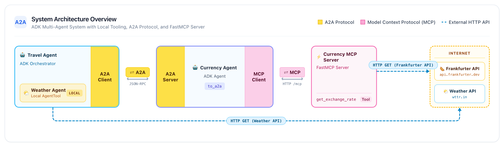

# Getting Started with MCP & A2A with ADK

[](https://www.python.org/)
[](https://github.com/google/adk-python)
[](https://github.com/google-a2a/a2a-python)
[](https://modelcontextprotocol.io/)
[](LICENSE)

A sample multi-agent system demonstrating **Model Context Protocol (MCP)** and 
**Agent2Agent (A2A)** working together with **Agent Development Kit (ADK)**. 
All services can be run completely locally or fully deployed to Google Cloud Run.



---

## Overview

The sample aims at laying out a foundation and showcasing the capabilities
of MCP + A2A + ADK.

###  Model Context Protocol (MCP)

> MCP is an open protocol that standardizes how applications provide context to LLMs. Think of MCP like a USB-C port for AI applications. Just as USB-C provides a standardized way to connect your devices to various peripherals and accessories, MCP provides a standardized way to connect AI models to different data sources and tools. - [Anthropic](https://modelcontextprotocol.io/introduction)

The MCP server in this example exposes a tool `get_exchange_rate` that can be used to get the exchange rate between two currencies such as USD and EUR. It leverages the [Frankfurter](https://www.frankfurter.dev/) API to get the currency exchange rate. Our agent uses an MCP client to invoke this tool when needed.

###  Agent2Agent (A2A)

> Agent2Agent (A2A) protocol addresses a critical challenge in the AI landscape: enabling gen AI agents, built on diverse frameworks by different companies running on separate servers, to communicate and collaborate effectively - as agents, not just as tools. A2A aims to provide a common language for agents, fostering a more interconnected, powerful, and innovative AI ecosystem. - [A2A](https://github.com/a2aproject/A2A)

In this sample, ADK is used to expose agents as A2A servers and also consume them
as remote A2A agents. 

###  Agent Development Kit (ADK)

> ADK is a flexible and modular framework for developing and deploying AI agents. While optimized for Gemini and the Google ecosystem, ADK is model-agnostic, deployment-agnostic, and is built for compatibility with other frameworks. - [ADK](https://github.com/google/adk-python)

ADK is used as the orchestration framework for creating our agents in this sample. It handles the conversation with the user and invokes our MCP tool when needed and handles the
A2A communication for our agents.

## 🏗️ Architecture Overview

The system consists of 2 agents talking to each other via A2A, 1 local agent,
and 1 MCP server:

```
+-----------------------------------------------------------------------------------+
|                                  Clients                                          |
|                ADK Web UI  |  A2A Test Clients  |  HTTP Callers                   |
+------------------------------------------+----------------------------------------+
                                           | (A2A Protocol / JSON-RPC)
                                           v
+-----------------------------------------------------------------------------------+
| travel_agent (Port 8082 / Cloud Run)                                              |
| - Orchestrating ADK Agent exposed via A2A (to_a2a)                                |
|                                                                                   |
|   +--> [Local AgentTool] weather_agent (travel_agent/subagents/weather_agent.py)  |
|        - Directly wrapped as AgentTool (no A2A network overhead)                  |
|        - Live weather tool via wttr.in API with fallback                          |
|   +--> [Remote AgentTool] currency_agent                                          |
|        - Communicates over A2A protocol                                           |
+------------------------------------------+----------------------------------------+
                                           | (A2A Protocol / JSON-RPC)
                                           v
+-----------------------------------------------------------------------------------+
| currency_agent (Port 8081 / Cloud Run)                                            |
| - Specialized ADK Agent exposed via A2A (to_a2a)                                  |
| - Consumes get_exchange_rate tool via FastMCP Streamable HTTP client              |
+------------------------------------------+----------------------------------------+
                                           | (MCP Streamable HTTP /mcp)
                                           v
+-----------------------------------------------------------------------------------+
| currency_mcp_server (Port 8080 / Cloud Run)                                       |
| - FastMCP server providing real-time exchange rates via Frankfurter API           |
+-----------------------------------------------------------------------------------+
```

### Key Components

- **`currency_mcp_server/`**: A FastMCP server exposing the `get_exchange_rate` tool over Streamable HTTP (`/mcp`), backed by the public [Frankfurter API](https://api.frankfurter.dev/).
- **`currency_agent/`**: An ADK agent connected to the MCP server. Exposed as an A2A service (`to_a2a`).
- **`travel_agent/`**: A travel assistant ADK agent exposed as an A2A service (`to_a2a`). It coordinates between:
  - **`weather_agent`** (in `travel_agent/subagents/`): A **local agent wrapped as an `AgentTool`**, demonstrating in-process agent tool usage without A2A network hops.
  - **`currency_agent`**: A **remote agent wrapped as an `AgentTool`**, delegating requests over the A2A protocol.

---

## 📦 Dependency Management (`uv` Workspace)

Project dependencies are organized as a unified **`uv` Workspace**:
- Root `pyproject.toml` orchestrates workspace members (`currency_mcp_server`, `currency_agent`, `travel_agent`).
- Running `uv sync` at the root automatically resolves and installs all packages for local development into a single `.venv`.
- Each service directory has its own self-contained `pyproject.toml` and `Dockerfile` for independent Cloud Run builds.

---

## 🚀 Getting Started

### Prerequisites

- Python 3.10+
- [uv](https://docs.astral.sh/uv/getting-started/installation):
  ```bash
  # macOS / Linux
  curl -LsSf https://astral.sh/uv/install.sh | sh
  ```
- Google Cloud SDK (`gcloud`) if deploying to Cloud Run.

### Installation

1. Clone repository:
   ```bash
   git clone https://github.com/meteatamel/currency-agent.git
   cd currency-agent
   ```

2. Install all dependencies across the workspace:
   ```bash
   uv sync
   ```

3. Configure Environment Variables:
   Create a `.env` file in the project root.

   **Option A: Google AI Studio (Recommended for quick testing)**
   ```sh
   GOOGLE_API_KEY=<your_api_key_here>
   GOOGLE_GENAI_USE_ENTERPRISE=FALSE
   ```

   **Option B: Gemini Enterprise / Vertex AI (Google Cloud)**
   ```sh
   GOOGLE_GENAI_USE_ENTERPRISE=TRUE
   GOOGLE_CLOUD_PROJECT=<your_gcp_project_id>
   GOOGLE_CLOUD_LOCATION=global
   ```

---

## 💻 Local Execution

You can run all three services concurrently in separate terminal windows:

### Terminal 1: Currency MCP Server (Port 8080)
```bash
uv run python currency_mcp_server/server.py
```
*Test the MCP server:*
```bash
uv run python currency_mcp_server/test_server.py
```

### Terminal 2: Currency Agent (Port 8081)
```bash
uv run python currency_agent/agent.py
```
*Test Currency Agent via A2A client:*
```bash
uv run python currency_agent/test_a2aclient.py
```

### Terminal 3: Travel Agent (Port 8082)
```bash
uv run python travel_agent/agent.py
```
*Test Travel Agent via A2A client:*
```bash
uv run python travel_agent/test_a2aclient.py
```
This test runs end-to-end:
1. Queries travel and currency conversion (delegated via A2A to `currency_agent` -> `currency_mcp_server`).
2. Queries weather forecasts (delegated to local `weather_agent` in `travel_agent/subagents/`).

### ADK Web UI
To explore and chat with the agents using the interactive ADK visual interface:
```bash
uv run adk web
```
Open your browser at `http://localhost:8000` to interact with `currency_agent` and `travel_agent`.

---

## ☁️ Cloud Run Deployment

All three components include optimized Dockerfiles and can be deployed directly from source to Cloud Run. You can use `gcloud` to automatically capture service URLs and wire them into the next steps without manual copy-pasting.

### Step 1: Deploy Currency MCP Server

```bash
# Deploy MCP server
gcloud run deploy currency-mcp-server \
  --source currency_mcp_server \
  --region us-central1 \
  --allow-unauthenticated

# Capture the deployed MCP server URL
MCP_SERVER_URL=$(gcloud run services describe currency-mcp-server --region us-central1 --format='value(status.url)')/mcp
echo "MCP Server URL: $MCP_SERVER_URL"
```

### Step 2: Deploy Currency Agent

Since `currency-agent`'s public URL is only generated upon its first deployment, deploy the service first, capture its URL, and then set `AGENT_URL` via a fast configuration update:

```bash
# 1. Deploy Currency Agent with the MCP Server URL
gcloud run deploy currency-agent \
  --source currency_agent \
  --region us-central1 \
  --allow-unauthenticated \
  --set-env-vars MCP_SERVER_URL="$MCP_SERVER_URL"

# 2. Capture its assigned Cloud Run URL
CURRENCY_AGENT_URL=$(gcloud run services describe currency-agent --region us-central1 --format='value(status.url)')
echo "Currency Agent URL: $CURRENCY_AGENT_URL"

# 3. Update AGENT_URL so the agent advertises its public HTTPS endpoint in its Agent Card
gcloud run services update currency-agent \
  --region us-central1 \
  --update-env-vars AGENT_URL="$CURRENCY_AGENT_URL"
```
*(If using Google AI Studio API key, add `,GOOGLE_API_KEY=<KEY>` to `--set-env-vars` or use Secret Manager).*

### Step 3: Deploy Travel Agent

Deploy `travel-agent` connected to `CURRENCY_AGENT_URL`, then set its own `AGENT_URL`:

```bash
# 1. Deploy Travel Agent connected to Currency Agent
gcloud run deploy travel-agent \
  --source travel_agent \
  --region us-central1 \
  --allow-unauthenticated \
  --set-env-vars CURRENCY_AGENT_URL="$CURRENCY_AGENT_URL"

# 2. Capture its assigned Cloud Run URL
TRAVEL_AGENT_URL=$(gcloud run services describe travel-agent --region us-central1 --format='value(status.url)')
echo "Travel Agent URL: $TRAVEL_AGENT_URL"

# 3. Update AGENT_URL so Travel Agent advertises its public HTTPS endpoint in its Agent Card
gcloud run services update travel-agent \
  --region us-central1 \
  --update-env-vars AGENT_URL="$TRAVEL_AGENT_URL"
```

You can now test the fully deployed Travel Agent on Cloud Run directly from your local terminal over A2A:
```bash
AGENT_URL="$TRAVEL_AGENT_URL" uv run python travel_agent/test_a2aclient.py
```

### 🧪 Testing with ADK Web UI

You can also use the interactive ADK visual web interface (`adk web`) to test your agents against the services deployed to Cloud Run:

#### 1. Test Currency Agent backed by Cloud Run MCP Server
Point `currency_agent` to the deployed MCP server:
```bash
MCP_SERVER_URL="$MCP_SERVER_URL" uv run adk web currency_agent
```
Open `http://localhost:8000`, select `currency_agent`, and ask:
> *"What is the exchange rate from 100 USD to EUR?"*

#### 2. Test Travel Agent backed by Cloud Run Currency Agent (over A2A)
Point `travel_agent` to the deployed Cloud Run Currency Agent:
```bash
CURRENCY_AGENT_URL="$CURRENCY_AGENT_URL" uv run adk web travel_agent
```
Open `http://localhost:8000`, select `travel_agent`, and ask:
> *"I'm planning a trip to Tokyo. What is the weather like and how much is 500 USD in JPY?"*

This tests the full multi-agent workflow in the UI:
- In-process execution of the local `weather_agent` tool.
- Remote A2A invocation across the internet to `currency-agent` on Cloud Run.
- Remote MCP invocation to `currency-mcp-server` on Cloud Run.

#### 3. Test Both Agents Simultaneously
To load both agents into the Web UI dropdown while connected to Cloud Run:
```bash
MCP_SERVER_URL="$MCP_SERVER_URL" CURRENCY_AGENT_URL="$CURRENCY_AGENT_URL" uv run adk web
```

---

## 📄 License

This project is licensed under the Apache 2.0 License - see the [LICENSE](LICENSE) file for details.
